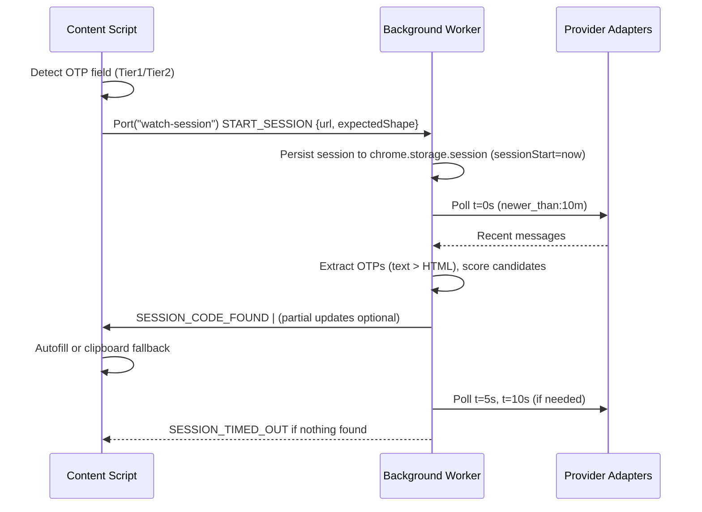

# InboxKey Watch Sessions v2 — Domain Scoring, Recency, and Autofill UX
**Status:** Draft for implementation and handoff  
**Audience:** Engineers (content scripts, background worker, extraction/matching), QA, Design, and Docs  
**Scope:** Field detection → Watch sessions → Mail polling → Extraction → Matching → Autofill/fallback → UX states

> This document specifies how InboxKey should detect verification prompts on websites, start a short-lived **watch session**, score **recent** mailbox candidates with **domain affinity**, autofill safely, and communicate state to users. It also formalizes UI/UX, testing, and acceptance criteria so this can be implemented and reviewed end-to-end.

---

## 1) Goals & Non‑Goals

### Goals
- **Precision-first** autofill: prefer no fill over wrong fill; expose safe fallbacks.
- **Fast & local**: sub‑50 ms extraction, sub‑200 ms UI updates; all processing stays on-device.
- **MV3‑compliant watch sessions**: short, resilient polling windows (0/5/10 s), surviving worker restarts.
- **Domain‑aware matching**: select the code whose sender/brand is most closely related to the active site.
- **Recency‑aware ranking**: prefer “just arrived” codes; de‑emphasize stale ones automatically.
- **Clear UX states**: user always knows whether we’re listening, filling, or fell back to clipboard.

### Non‑Goals
- No server calls, telemetry, or cloud training.
- No OCR or image‑based code extraction.
- No auto-submit (keep user in control).

> **Why now:** Users often have multiple codes in their inbox. Picking the **right brand** and **freshest** message wins real-time reliability without compromising privacy.

---

## 2) Principles

1. **Privacy‑first, local‑only** — no data leaves the device; read-only mailbox access; selective encryption in storage.  
2. **Layered microkernel** — Presentation → Application Services → Domain Logic → Infrastructure. Each layer owns its concerns with typed contracts.  
3. **Resilient MV3 runtime** — every workflow must tolerate worker restarts; use session storage + alarms for durability; content scripts reconnect idempotently.  
4. **Precision over recall** — wrong autofills are worse than manual steps; we always provide a transparent fallback.  
5. **Accessibility & clarity** — always communicate state changes (listening/success/fail), keyboard-first, ARIA-ready components.

---

## 3) Current Baseline (What We Have)

- **Field detection** (Tier 1 fast + Tier 2 deep), Shadow DOM support.  
- **Content script** opens a **watch session** via `chrome.runtime.Port` on detection; sends keepalive PINGs every 8 s.  
- **Background service worker** creates a session (persisted in `chrome.storage.session`) and schedules mailbox polls at **t=0/5/10 s** (dual: `setTimeout` + `chrome.alarms`).  
- **Extraction** finds numeric/alphanumeric OTPs with contextual windows; **Matching** selects best candidate.  
- **Autofill** sets the value and dispatches events (`input`, `change`, `keydown`, `keyup`) with visual feedback; **Fallback** copies to clipboard and shows a toast.  
- **Sessions** expire at ~15 s; interim results cached for manual use in popup.

*This matches our MV3 architecture, privacy posture, and UI surfaces (Popup/Settings).*
 
---

## 4) What We Are Adding (This Spec)

1. **DomainAffinity** — brand/site correlation: exact eTLD match, alias domain mapping, subject token overlap.  
2. **RecencyBoost** — exponential decay (favor just‑arrived codes), with **SessionBoost** for messages after session start.  
3. **Expected Shape Bias** — use field-derived `{len, charset}` to nudge extraction/matching.  
4. **UX improvements** — tray/badge states, in‑page “listening” chip, consistent success/fail toasts.  
5. **Edge‑case hardening** — alias tables, multiple accounts, segmented inputs, restarts, and clipboard fallback rules.

---

## 5) End‑User Journey (Happy Path)

**Scenario:** User logs into `https://github.com/login`.

1. **Detection** — We detect the verification field (Tier 1 hits `autocomplete="one-time-code"`).  
2. **Watch session starts** — A status chip appears: “Listening for a code…”. The extension icon shows a small spinner.  
3. **Polling** — Background polls at **0/5/10 s** for messages newer than **10 min**.  
4. **Extraction & Matching** — A code from `no-reply@github.com` arrives; DomainAffinity=**1.0** (exact match), RecencyBoost ≈ **0.20** (just now), SessionBoost=**0.15**.  
5. **Autofill** — Field passes safety checks; we fill; the field glows green for 2 s; the icon flips to a check.  
6. **Cleanup** — Session ends, result cached for manual use.

**Timing:** The user typically sees a fill within 2–6 seconds of email arrival.

---

## 6) Alternate Journeys & Feedback

- **Clipboard fallback:** Field is readonly or blocked → we copy the code and present a toast: “Copied; click the field and paste.”  
- **No code by 15 s:** The session ends; toast: “No new code for github.com. Resend or open popup.”  
- **Multiple candidates:** We pick the most recent message whose sender is best aligned to the site; the user can override from the popup list.  
- **Magic link detected:** If the page does not expose a code field but a login flow expects a link, we surface the newest domain‑matched link and a button to open it (same tab by default).

---

## 7) UX & UI States

### Extension Icon (background)
- **Idle:** no badge.  
- **Listening:** badge cycles “·” → “··” → “···” every 400 ms.  
- **Success:** badge “✓” (green icon variant).  
- **No code:** badge “!”.

### In‑Page Chip (content)
- **Listening:** neutral chip near detected field: “Listening for a code…”.  
- **Filled:** “Filled ✓”.  
- **Clipboard:** “Code copied—paste into the field.”  
- **No code:** “No new code—try resend or open popup.”

### Toaster Notifications (content)
- Use the existing notification system with `success | info | error` variants and auto-dismiss timers.

### Accessibility
- Chip and toasts are keyboard‑dismissible (`Esc`), announce via `aria-live="polite"`, and observe reduced motion preferences.

---

## 8) Data & Control Flow (Detailed)



---

## 9) Algorithms & Scoring

### 9.1 DomainAffinity(siteETLD, senderETLD, subject) → [0..1]
1. **Exact eTLD match** → `1.0`  
2. **Alias match** (e.g., `dropboxmail.com` → `dropbox.com`) → `0.9`  
3. **Token overlap** (site token appears in sender or subject) → `0.6`  
4. Else → `0.0`

Minimal alias map example:
```ts
const ALIASES: Record<string, string[]> = {
  'dropbox.com': ['dropboxmail.com'],
  'github.com': ['github.github.io', 'githubusercontent.com'],
  'battlestategames.com': ['escapefromtarkov.com','tarkov.com'],
};
```

### 9.2 RecencyBoost(ageSec) → [0..0.20]
`0.20 * exp(-ageSec / 120)`  
- 0 s: +0.20  
- 120 s (~2 min): +0.07  
- 300 s (~5 min): +0.01

### 9.3 SessionBoost(receivedAt, sessionStart) → {0 or +0.15}
`receivedAt >= (sessionStart - 15_000) ? 0.15 : 0`

### 9.4 Expected Shape Bias
- +0.20 if length matches `expected.len`  
- +0.06 if diff by ±1  
- -0.12 if outside ±1  
- +0.08 if charset matches

### 9.5 Putting It Together (points-based matcher)
```ts
score =
  (DomainAffinity * 100) +                    // replaces fixed +100
  round(RecencyBoost * 250) +                 // 0..50
  round(SessionBoost * 100) +                 // 0 or +15
  (expectedShapeMatch ? +8 : 0) +
  (alreadyUsed ? -50 : 0);
accept if score >= 10;
```

---

## 10) Content Script — Field Detection & Session Start

### Detection Heuristics
- **Tier 1 (<1 ms):** `autocomplete="one-time-code|otp"`, name/id patterns, `inputmode` + `maxlength` combos.  
- **Tier 2 (<50 ms):** labels, placeholders, pattern attribute, nearby text/buttons, form action URL patterns, Shadow DOM traversal.  
- **Exclusions:** email/password/zip/cvv fields.

### Watch Session Start (Port)
```ts
// content/watch-session.ts
const port = chrome.runtime.connect({ name: 'watch-session' });
port.postMessage({
  type: 'START_SESSION',
  url: location.href,
  expectedShape: { len: 6, charset: 'digits' } // inferred from field
});
// Keepalive every 8s
setInterval(() => port.postMessage({ type: 'PING' }), 8000);
```

---

## 11) Background — Session Controller & Polling

### Session Lifecycle
- Create `{id, url, siteETLD, expectedShape, sessionStart}`; persist to `chrome.storage.session` to survive restarts.  
- Schedule polls at **t=0/5/10 s** using **both** `setTimeout` and `chrome.alarms`; whichever fires first executes the poll.  
- On each poll: query providers for messages **newer than 10 min**, extract OTPs (plaintext preferred, HTML normalized), compute scores, pick best.  
- On success: `SESSION_CODE_FOUND` → cancel remaining polls; mark code as used.  
- On timeout (no acceptable candidate): `SESSION_TIMED_OUT`.

### Restart Resilience
- On worker startup, reload sessions from `chrome.storage.session` and reschedule missing polls; content scripts reconnect by re‑opening Ports or retrying PINGs.

---

## 12) Autofill & Fallback

### Safety Checks
1. Field exists and is visible (non-zero rect, not `visibility:hidden`, not `display:none`).  
2. Not `readonly` / not `disabled`.  
3. In focus (call `focus()`); dispatch `input`, `change`, `keydown`, `keyup` events after setting value.  
4. For segmented UIs (6 single‑char inputs), fill one per box.

### Fallback
- If blocked (framework guard / readonly), copy to clipboard and show “Copied” toast.  
- Never auto-submit; respect user control and potential MFA step‑ups.

---

## 13) UI Copy & Micro‑States (final strings)

- **Listening (chip):** “Listening for a code…”  
- **Filled (chip):** “Filled ✓”  
- **Copied (toast):** “Code copied—paste into the field.”  
- **No code (toast):** “No new code for **{site}**. Try resend or open the popup.”  
- **Popup empty state:** “No recent codes. Resend or check connected mailbox.”

All strings localizable; avoid idioms; use sentence case; keep < 60 characters where possible.

---

## 14) Edge Cases & Mitigations

- **Alias domains** (brand sends from different eTLD): maintain a small alias map; allow token overlap fallback.  
- **Multiple accounts** (same brand across inboxes): DomainAffinity + RecencyBoost select the latest from the relevant account; surface sender in popup.  
- **Spam/marketing** (“security tips” newsletters): footer/newsletter penalties remain in extraction scoring.  
- **Backup codes lists**: if a message contains many code-like lines + “backup/recovery”, do not consider for watch sessions.  
- **Readonly fields / script‑guarded inputs**: clipboard fallback with clear instruction.  
- **Service-worker restart**: dual scheduling + session persistence; content script keepalive ensures reconnection.  
- **International numerals / grouped codes**: normalization in extractor (full‑width digits, Arabic‑Indic, NBSP separators).  
- **Magic link only** flows: if no OTP field, watch session can still retrieve and present a link with domain/recency ranking.

---

## 15) Configuration

```ts
WATCH_SESSION = {
  pollTimesMs: [0, 5000, 10000],  // 15s window total
  newerThanMinutes: 10,
  score: {
    domainWeight: 100,           // multiplier for DomainAffinity
    recencyToPoints: 250,        // 0..0.20 → 0..50
    sessionToPoints: 100,        // 0 or +15
    expectedShapeTieBreaker: 8,
    usedPenalty: -50,
    acceptMin: 10
  }
}
```

---

## 16) Security & Privacy

- Read‑only mailbox scopes; no modification or sending.  
- Local‑only processing; tokens and caches never leave the device.  
- AES‑256‑GCM encryption for sensitive records; lock mode gates access.  
- Minimal permissions; preference for in‑page toasts over system notifications.  
- No auto‑opening of password‑reset links; warnings on risky actions.

---

## 17) Performance Budgets

- Field detection: **< 1 ms** (Tier 1), **< 50 ms** (Tier 2).  
- Popup open: **≤ 200 ms**.  
- Extraction per email: **< 50 ms**.  
- Session UI latency (icon/chip state): **≤ 100 ms** on state changes.

---

## 18) Testing Strategy

### Unit (Vitest)
- DomainAffinity cases: exact, alias, token overlap, none.  
- RecencyBoost decay curve; SessionBoost gating.  
- Expected shape bias application in scoring.  
- Field detector heuristics & exclusions.

### Integration
- Session controller: scheduling, dual timers, persistence, restart recovery.  
- Provider adapters: “newer than 10 m” filters, paging edges, auth errors.

### E2E (Playwright)
- Happy path: detect → listen → receive code → autofill → chip ✓.  
- Readonly field: detect → copy → toast.  
- No code: detect → listen → timeout → toast.  
- Restart mid-session: ensure recovery and correct timeout behavior.  
- Multi-sender: verify domain+recency select the right brand.

**Acceptance gates** (cannot ship unless all pass):
- Precision at auto‑accept threshold **≥ current** on our internal corpus.  
- No regressions in accessibility checks (focus, ARIA, reduced motion).  
- No new permissions added.

---

## 19) Rollout Plan

1. **Behind a feature flag**: `watchSessionV2` in options; defaults off for first RC.  
2. **Dark launch**: enable for internal testers; collect manual feedback (no telemetry).  
3. **Staged enable**: enable by default in the next minor version; keep flag for rollback.  
4. **Docs**: update FAQ and popup tips.

---

## 20) Open Questions (tracked as issues)

- Expandable alias map: curated JSON or learned locally over time?  
- Per‑provider polling backoff under quota pressure?  
- Should we surface a “Resend” shortcut for popular sites where feasible?

---

## 21) References
- Architecture and MV3 constraints (watch sessions, polling cadence, layering).  
- Public feature list (privacy, local‑only, encryption, supported providers).

---

## 22) Appendix — Sample Code (Pseudocode)

**DomainAffinity**
```ts
export function domainAffinity(siteETLD: string, senderETLD: string, subject?: string): number {
  if (siteETLD === senderETLD) return 1.0;
  const alias = ALIASES[siteETLD] || [];
  if (alias.includes(senderETLD)) return 0.9;

  const toTokens = (s: string) => (s||'').toLowerCase().replace(/[^a-z0-9]+/g, ' ').split(' ').filter(Boolean);
  const siteTokens = toTokens(siteETLD.split('.').slice(0, -1).join('.')); // drop TLD
  const senderTokens = toTokens(senderETLD);
  const subjectTokens = toTokens(subject || '');

  const set = new Set([...senderTokens, ...subjectTokens]);
  const overlap = siteTokens.filter(t => set.has(t)).length;
  return overlap >= 1 ? 0.6 : 0.0;
}
```

**Recency**
```ts
export const recencyBoost = (ageSec: number) => 0.20 * Math.exp(-ageSec / 120);
export const sessionBoost = (receivedAt: number, sessionStart: number) =>
  receivedAt >= (sessionStart - 15000) ? 0.15 : 0;
```

**Points-based Match**
```ts
const points =
  affinity*100 +
  Math.round(recencyBoost(ageSec)*250) +
  Math.round(sessionBoost(ts, sessionStart)*100) +
  (expectedShapeMatch ? 8 : 0) +
  (alreadyUsed ? -50 : 0);

if (points >= 10) accept();
```

---

## 23) Summary

- We extend our existing watch‑session architecture with **DomainAffinity**, **RecencyBoost**, and a clear **UX** that communicates listening, success, and fallback.  
- The result is **faster, safer**, and **more predictable** autofill—still **100% local** and MV3‑compliant.

