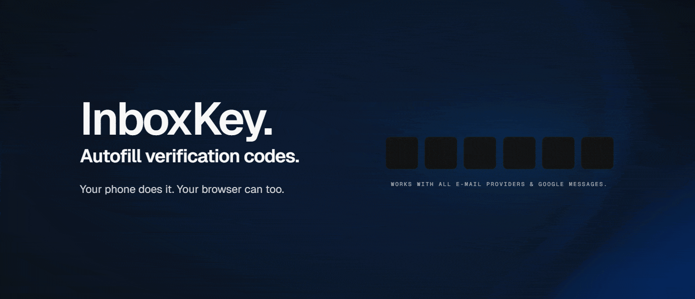
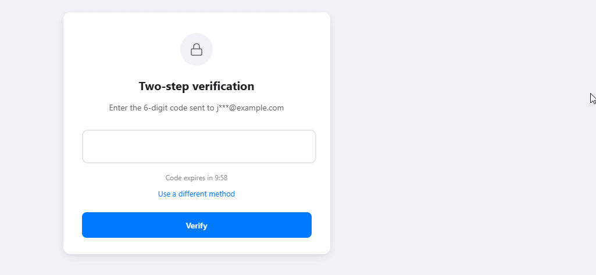

<p align="center">
  
</p>

# InboxKey - Autofill Verification Codes

Privacy-first email verification code autofill and magic-link opener for Chrome.

[](https://chromewebstore.google.com/detail/mioicbneapdjamkppcidooggnmegpocn)
[](PRIVACY.md)
[](LICENSE)
[](https://claude.com/claude-code)
[](https://openai.com/codex)

> [!IMPORTANT]
> InboxKey processes verification emails locally on your device. There is no backend, no analytics, and no third-party tracking.

[Install from Chrome Web Store](https://chromewebstore.google.com/detail/mioicbneapdjamkppcidooggnmegpocn) | [Website](https://inboxkey.net) | [Build from source](#build-from-source) | [Privacy](PRIVACY.md) | [Security](SECURITY.md) | [Source](https://github.com/slmnsrf/inboxkey)

## Why InboxKey

Every sign-in flow that ends with "check your email" breaks momentum. InboxKey shortens that loop. It detects verification fields, checks recent verification emails, and fills the best match without routing your data through someone else's server.

InboxKey is a source-available solo project. The full source code is public so you can verify exactly what it does with your data. The goal is simple: make verification flows faster without turning email access into a cloud service.

## Install

InboxKey is live on the Chrome Web Store:

[Install InboxKey from the Chrome Web Store](https://chromewebstore.google.com/detail/mioicbneapdjamkppcidooggnmegpocn)

After installing the extension, set up InboxBridge (see the section below) to connect your mailbox over IMAP.

## Build From Source

```bash
git clone https://github.com/slmnsrf/inboxkey.git
cd inboxkey
pnpm install
cd extension
npm run build
```

Load it in Chrome:

1. Open `chrome://extensions`
2. Enable `Developer mode`
3. Click `Load unpacked`
4. Select `extension/build/chrome-mv3-prod/`

## Email Support

| Provider | Setup |
| --- | --- |
| Gmail | InboxBridge + App Password (requires 2-Step Verification enabled). Connect via Add Account → IMAP. |
| Outlook, Yahoo, Fastmail, ProtonMail Bridge, custom IMAP | InboxBridge + IMAP credentials. |

## How It Works

1. Install InboxBridge, then connect your mailbox via IMAP.
2. Visit a site that asks for a verification code or magic link.
3. InboxKey detects the field, checks recent verification emails locally, and fills or opens the best match.

<p align="center">
  
</p>

## Privacy And Trust

- Local-only processing. InboxKey does not use a backend server.
- Read-only IMAP access. Credentials are stored in the OS keychain by the InboxBridge helper, not in the browser.
- No analytics, telemetry, ads, or third-party scripts.
- Source-available under PolyForm Noncommercial 1.0.0. Full source code is public for transparency.
- Local state uses Chrome `storage.local` and `storage.session`. Additional encryption at rest is planned and not yet shipped.
- Production builds embed a short Git commit hash so a running build can be traced back to source.

Details: [PRIVACY.md](PRIVACY.md), [SECURITY.md](SECURITY.md), and [development.md](development.md)

## Support

InboxKey is free and source-available. If it saves you time and you want to support ongoing work, you can buy a coffee:

[](https://buymeacoffee.com/inboxkey)

No pressure. The extension stays free either way.

<details>
<summary><strong>InboxBridge</strong></summary>

InboxBridge is the local helper that connects to your mailbox via IMAP. It's required for all email providers including Gmail.

It:

- runs locally on your machine
- is written in Rust
- stores IMAP credentials in the OS keychain
- communicates with the extension over Chrome Native Messaging
- does not proxy mail through any remote service

Downloads: https://github.com/slmnsrf/inboxkey/releases  
Setup: [inboxbridge/README-SETUP.md](inboxbridge/README-SETUP.md)

</details>

<details>
<summary><strong>Development</strong></summary>

### Project Structure

```text
inboxkey/
  extension/            # Chrome extension (React + TypeScript)
  packages/
    extraction-core/    # Shared OTP and magic-link extraction logic
  apps/
    reviewer/           # Dev tool for labeling test data
  inboxbridge/          # Rust native messaging host for IMAP
```

### Tech Stack

- Extension framework: Plasmo (Manifest V3)
- UI: React 18 + TypeScript
- Storage: Chrome storage APIs (`local` + `session`)
- Testing: Vitest + Playwright
- IMAP bridge: Rust + Tokio

### Commands

All commands below run from `extension/`.

```bash
npm run dev
npm run build
npm run test
npm run test:e2e
npm run type-check
```

Full guide: [development.md](development.md)

</details>

---

[Website](https://inboxkey.net) | [Source Code](https://github.com/slmnsrf/inboxkey) | [Privacy Policy](PRIVACY.md) | [Security](SECURITY.md) | [Contributing](CONTRIBUTING.md) | [Issues](https://github.com/slmnsrf/inboxkey/issues)

<p align="center">
  <picture>
    <source media="(prefers-color-scheme: dark)" srcset="marketing/public/logo-horizontal-inverse.svg">
    
  </picture>
</p>
